# SummariesBotv2 — System Design Document

## Table of Contents
1. [Overview](#overview)
2. [High-Level Architecture](#high-level-architecture)
3. [Module Breakdown](#module-breakdown)
4. [Database Layer](#database-layer)
5. [Telegram Summaries Pipeline](#telegram-summaries-pipeline)
6. [Scheduling System](#scheduling-system)
7. [YouTube Monitor Pipeline](#youtube-monitor-pipeline)
8. [AI / LLM Layer](#ai--llm-layer)
9. [Authentication & Multi-User Model](#authentication--multi-user-model)
10. [Frontend (SPA)](#frontend-spa)
11. [Background Jobs](#background-jobs)
12. [Data Flow Diagrams](#data-flow-diagrams)

---

## Overview

SummariesBotv2 is a Telegram userbot + web admin panel that:
- Monitors configured Telegram source channels
- Categorizes incoming messages by topic using keyword matching
- Periodically generates AI summaries and sends them to target Telegram channels
- Monitors YouTube channels/keywords for new videos and summarizes them
- Provides a multi-user admin interface for managing bots, collections, topics, schedules, prompts, and monitoring results

**Stack:** FastAPI (Python) · PostgreSQL · Telethon (Telegram MTProto) · APScheduler · Google Gemini / OpenAI · Vanilla JS SPA

---

## High-Level Architecture

```mermaid
graph TD
    subgraph Browser
        UI[Single-Page App\nstatic/index.html + modern.js]
    end

    subgraph FastAPI App [app.py — FastAPI]
        MW[TokenAuthMiddleware]
        ROUTERS[API Routers\n/api/*]
        STATIC[Static File Server\n/static/]
    end

    subgraph Bot Task [Asyncio Task — summaries/bot.py]
        TC[Telethon Client\nMTProto userbot]
        SCHED[APScheduler\nper-topic jobs]
        WATCHER[scheduler_watcher\npoll every 2s]
    end

    subgraph YouTube [Asyncio Scheduler — youtube_monitor/]
        YT_WORKER[Video Queue Worker\nevery 5 min]
        YT_KEYWORDS[Keyword Search\nevery 5 min]
        YT_WEBSUB[WebSub Push\nPubSubHubbub]
    end

    subgraph AI [LLM Clients]
        GEMINI[GeminiClient\nVertex AI]
        OAI[OpenAIClient]
    end

    DB[(PostgreSQL)]

    UI -->|JWT Bearer| MW
    MW --> ROUTERS
    ROUTERS --> DB
    Bot Task -->|get_db()| DB
    YouTube -->|get_yt_db()| DB
    SCHED -->|trigger_summary| AI
    YT_WORKER --> AI
    TC -->|NewMessage events| Bot Task
    WATCHER -->|get_config_version\nevery 2s| DB
    WATCHER -->|rebuild on change| SCHED
```

---

## Module Breakdown

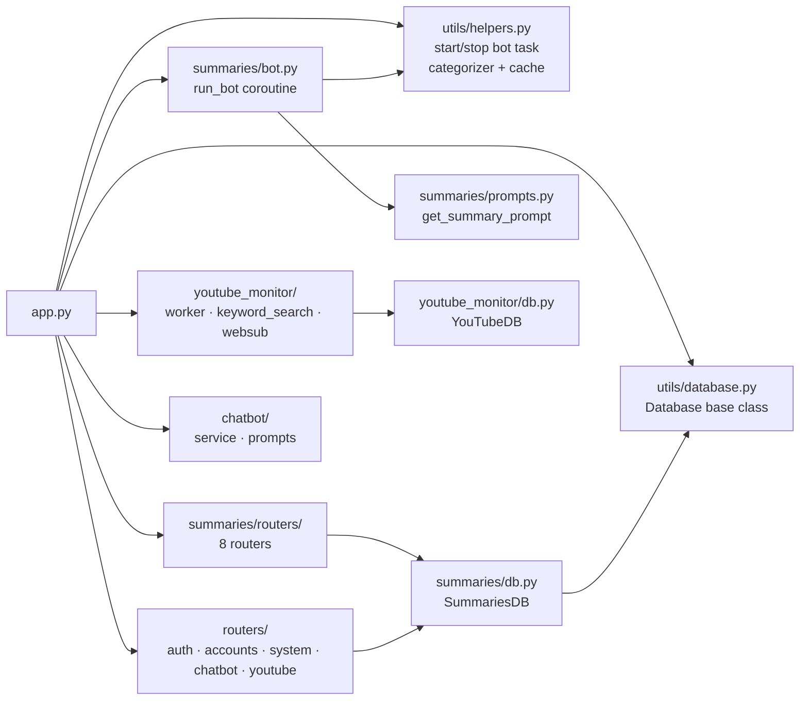

### Key Files

| File | Role |
|------|------|
| `app.py` | Entry point; mounts all routers; lifespan manages bot task + YouTube scheduler |
| `summaries/bot.py` | Telethon userbot; message handler; APScheduler setup; interim + scheduled summaries |
| `summaries/db.py` | `SummariesDB` — all summaries-specific DB queries |
| `summaries/prompts.py` | Prompt builder: fixed Arabic scope prefix + per-bot user template |
| `utils/database.py` | `Database` base class: pool, connection management, user/auth/plan methods |
| `utils/helpers.py` | `categorizer()` (TTL-cached + pre-compiled regex); `start_bot_task`/`stop_bot_task`; log buffer |
| `utils/gemini_client.py` | Gemini summarization client; returns `(text, tokens)` |
| `utils/openai_client.py` | OpenAI summarization client; returns `(text, tokens)` |
| `youtube_monitor/worker.py` | Picks pending YT videos; calls Gemini; sends via Telegram |
| `youtube_monitor/keyword_search.py` | Polls YouTube Data API for keyword matches |
| `routers/auth.py` | JWT login/validate; `is_admin_request` / `get_request_user_id` helpers |
| `static/js/modern.js` | All SPA UI logic (~7000 lines, vanilla JS) |

---

## Database Layer

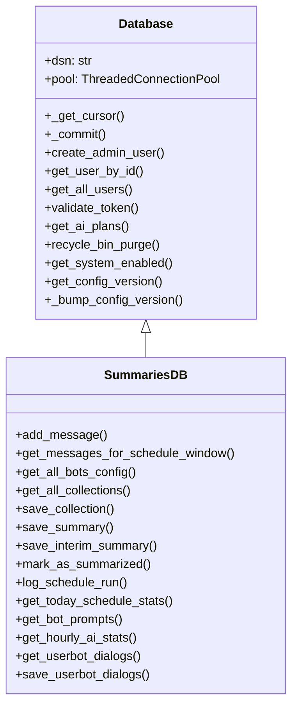

### Connection Pool Pattern

Every DB method follows this exact pattern — deviating causes pool exhaustion:

```python
def my_method(self, param):
    try:
        cursor = self._get_cursor()
        cursor.execute("...", (param,))
        return cursor.fetchall()
    finally:
        self._commit()   # always — returns connection to pool
```

`_commit()` is the only safe way to release a connection. Never use `db.connection.commit()`.

### Config Version

`config_version` is a counter in the DB incremented by every mutation (`_bump_config_version()`). The `scheduler_watcher` polls it every 2 seconds — any change triggers a full scheduler and channel-map rebuild, making new collections and topics take effect without a bot restart.

---

## Telegram Summaries Pipeline

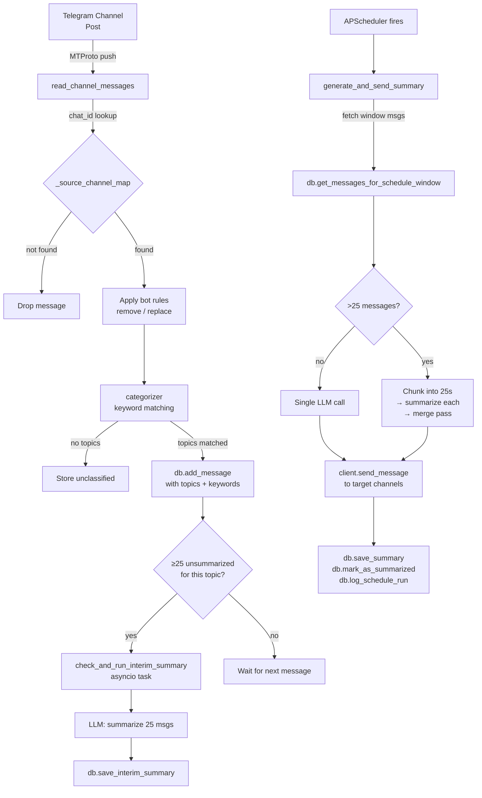

### Categorizer

The categorizer runs on every incoming message. It uses a TTL cache (30s) and pre-compiled per-topic regex to stay fast:

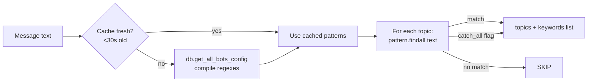

### Message Lifecycle

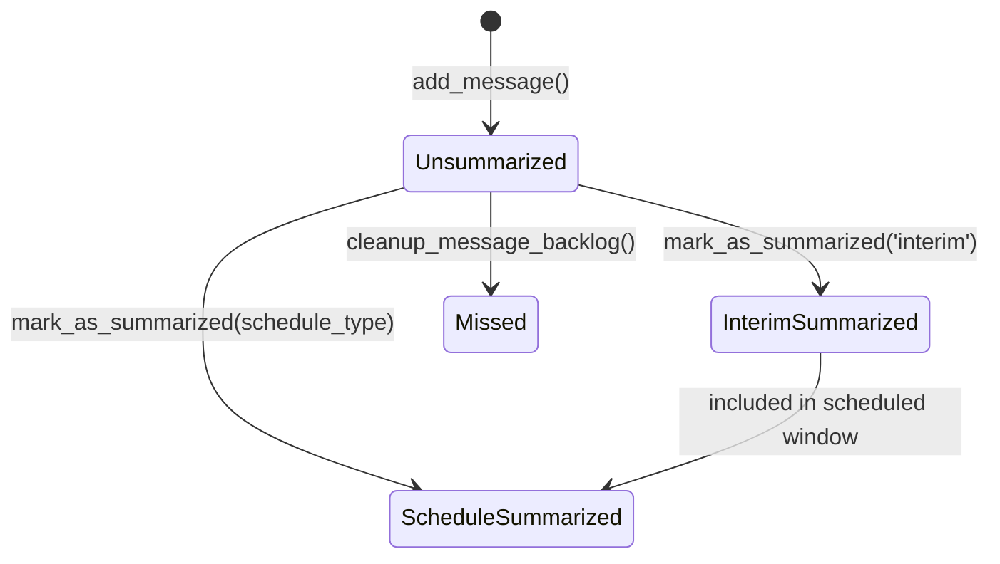

---

## Scheduling System

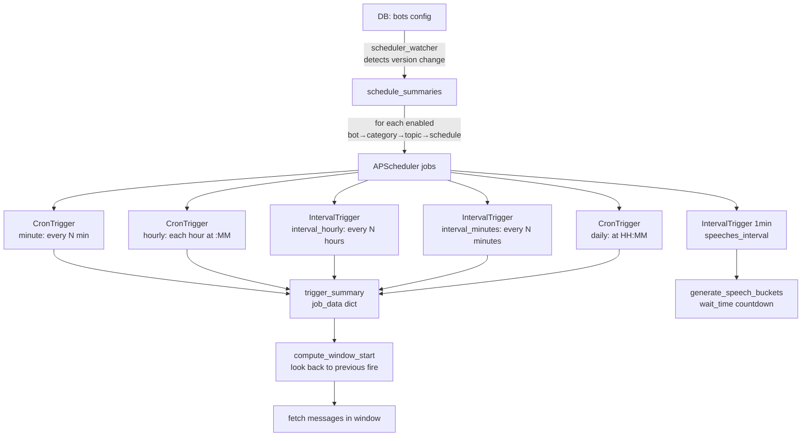

### Schedule Types

| Type | Trigger | Config Fields |
|------|---------|---------------|
| `minute` | CronTrigger `*/N` | `minute` (interval N) |
| `hourly` | CronTrigger `:MM` | `minute` |
| `interval_hourly` | IntervalTrigger hours | `hours`, `start_hour`, `start_minute`, `end_hour`, `end_minute` |
| `interval_minutes` | IntervalTrigger mins | `minutes`, `start_hour`, `start_minute`, `end_hour`, `end_minute` |
| `daily` | CronTrigger HH:MM | `hour`, `minute` |
| `speeches_interval` | IntervalTrigger 1min | `wait_time` (minutes before sending) |

**Active window gate:** `interval_hourly` and `interval_minutes` schedules support `end_hour`/`end_minute`. Fires outside the window are silently skipped.

---

## YouTube Monitor Pipeline

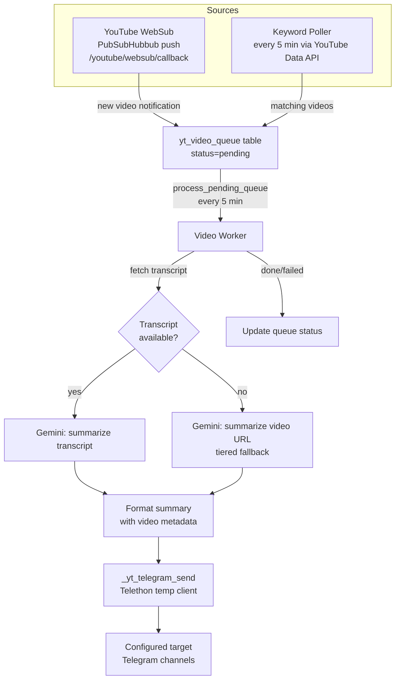

### WebSub Flow

YouTube's hub pushes a POST to `/youtube/websub/callback` when a subscribed channel publishes a video. The bot renews subscriptions every 9 days via APScheduler.

---

## AI / LLM Layer

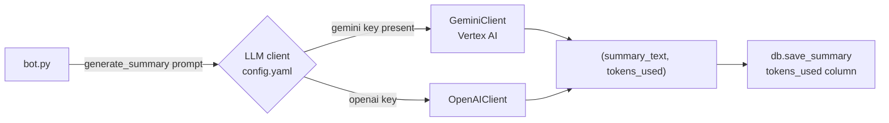

### Prompt Construction

```
[Fixed Arabic scope prefix]
  → injects {topic_name} and {messages}
  → scopes the LLM to relevant geographic/topic boundaries
---
User Prompt:
[Per-bot user-defined template from DB]
  → references {topic_name}
```

The system prompt is stored in `config.yaml` under `system_prompts.summaries_system` (overrides the hardcoded Arabic default). The fixed prefix and per-bot prompts are editable via the Prompts page.

### Chunked Summarization (>25 messages)

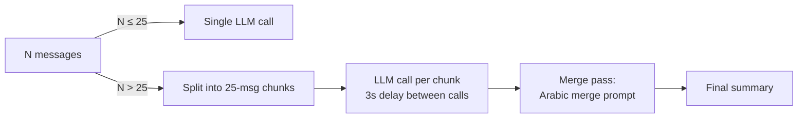

### Retry Logic

Network errors (`OSError`, `ConnectionError`, `TimeoutError`) are retried up to 3 times with exponential backoff: 5s → 15s → 45s.

---

## Authentication & Multi-User Model

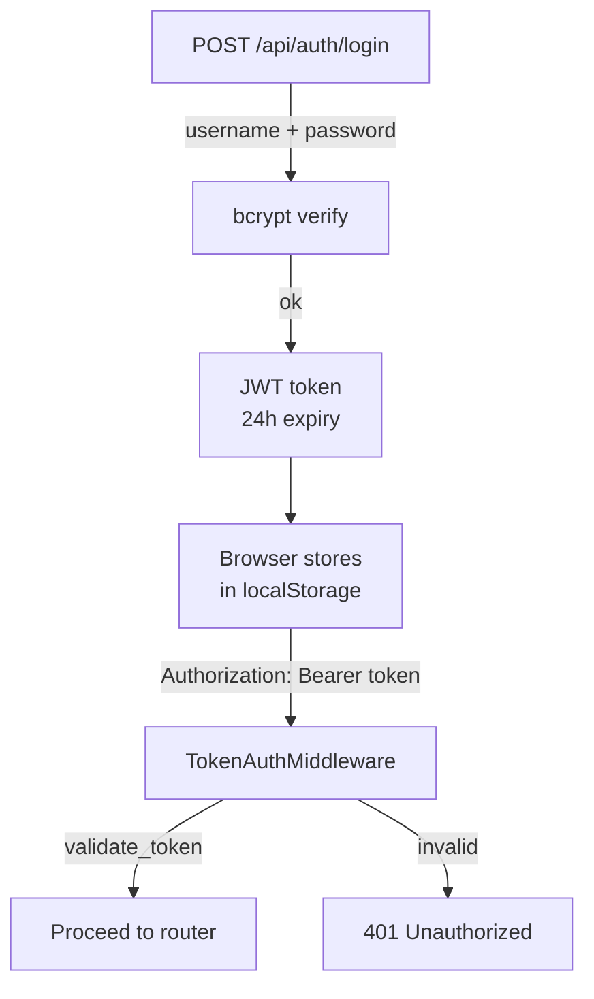

### Data Isolation

All major tables have an `owner_id` column:

| `owner_id` | Meaning |
|-----------|---------|
| `NULL` | Admin-owned (visible only to admin) |
| `<user_id>` | User-owned (visible only to that user) |

Every DB read/write method accepts `owner_id`. Admin passes `None` to see all data. Regular users pass their `user_id`.

Router pattern:
```python
if is_admin_request(request):
    owner_id = None          # admin sees everything
else:
    owner_id = get_request_user_id(request)
```

---

## Frontend (SPA)

```mermaid
flowchart TD
    LOAD[Page load\nindex.html] --> AUTH_CHECK[auth.js\ncheck JWT]
    AUTH_CHECK -->|no token| LOGIN[/login redirect]
    AUTH_CHECK -->|valid| INIT[modern.js\nloadAllData]

    INIT --> CFG[GET /api/config\nglobal bots + collections]
    INIT --> PRPTS[GET /api/prompts\nper-bot prompts]

    CFG & PRPTS --> NAV[Render nav\nSystem · Collections · Bots\nMonitor · Dashboard · etc.]

    NAV --> PAGE{Active page}
    PAGE --> BOTS[Bots page\nlazy-rendered categories + topics]
    PAGE --> MONITOR[Monitor page\nSchedules · Summaries · Messages\nUnclassified · Missed · History]
    PAGE --> DASH[Dashboard\ncharts + filters]
    PAGE --> YT_PAGE[YouTube page]
    PAGE --> CHATBOT_PAGE[Chatbot page]
```

### Key JS Patterns

| Pattern | Description |
|---------|-------------|
| `api(path, body?)` | GET if no body, POST if body; always checks `result.status === 'ok'` |
| `showConfirm / showAlert` | Custom dialogs — never use `window.confirm` |
| `escapeHtml / escapeHtmlSys` | XSS protection for table content vs HTML attributes |
| `_fmtLBN(iso)` | Formats any timestamp to Lebanon time (Asia/Beirut) |
| `_monTagsHtml(str, cls)` | Builds comma-separated `<span class="mon-tag">` chips |
| `renderBotsPage([topicId, catId])` | Re-renders bots page keeping accordions open |
| `loadAllData()` | Parallel fetch of config + prompts via `Promise.all` |
| Lazy body rendering | Category/topic boxes render header immediately; body on first open |
| `debounce(fn, 220ms)` | Wraps filter input handlers to avoid per-keystroke re-renders |

---

## Background Jobs

All background jobs are registered in `app.py`'s lifespan using a single `AsyncIOScheduler`:

| Job ID | Schedule | Purpose |
|--------|----------|---------|
| `yt_process_queue` | Every 5 min | Process pending YouTube video queue |
| `yt_keyword_search` | Every 5 min | Run due YouTube keyword searches |
| `yt_websub_renew` | Every 9 days | Renew YouTube WebSub subscriptions |
| `yt_cleanup` | Weekly | Purge old YouTube queue entries |
| `recycle_bin_purge` | Every 12h | Permanently delete recycle bin items >5 days old |
| `chatbot_suggestions` | Every 1h | Refresh AI chatbot suggestion cache |

The Telegram bot's own topic schedules live in a **separate** `AsyncIOScheduler` inside `bot.py`, rebuilt on every config version change.

---

## Data Flow Diagrams

### Full Message → Summary Flow

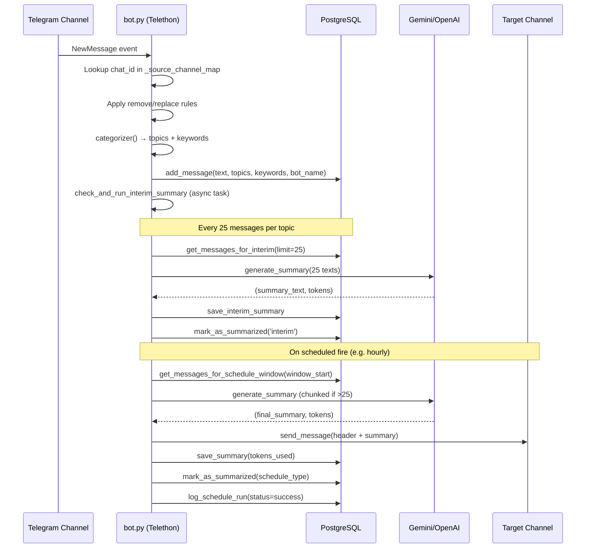

### Config Change → Scheduler Rebuild

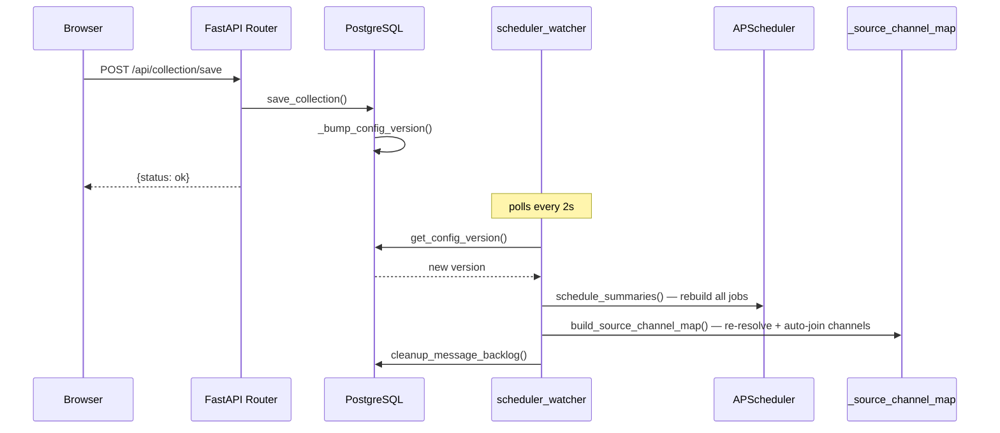

### Bot Lifecycle

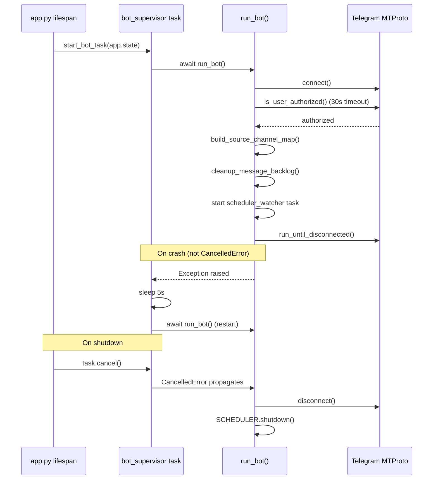
