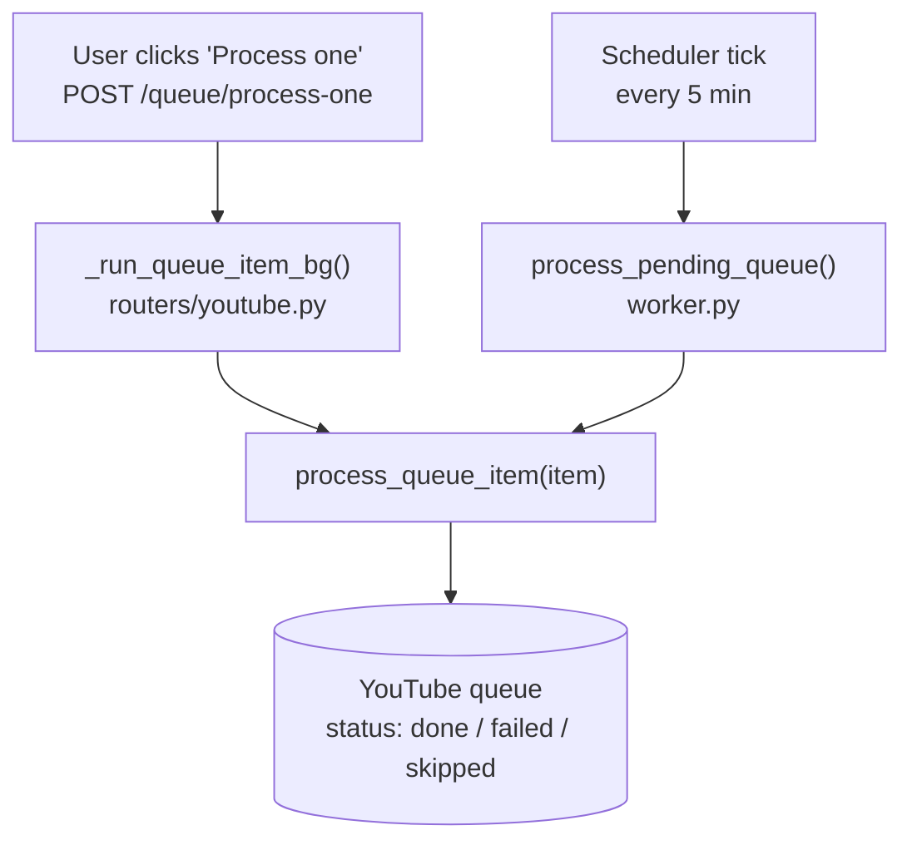
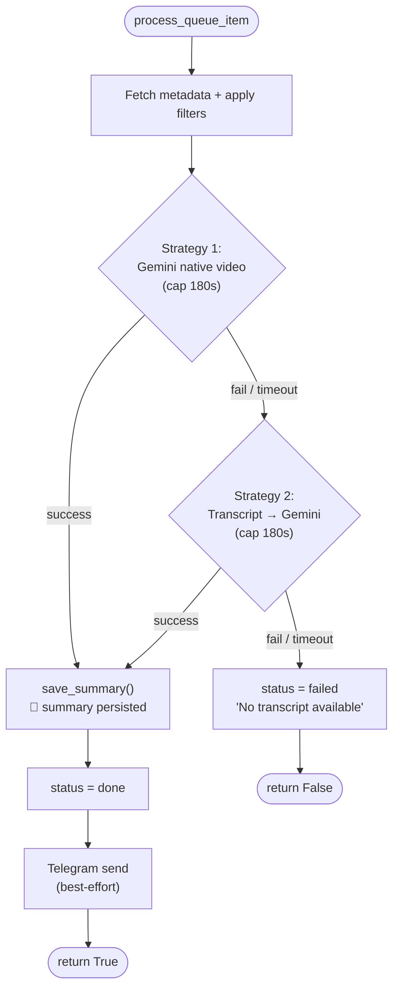
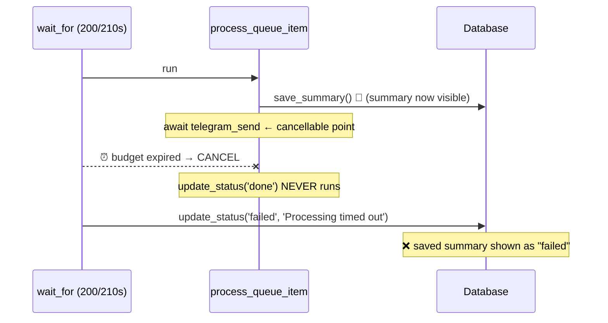
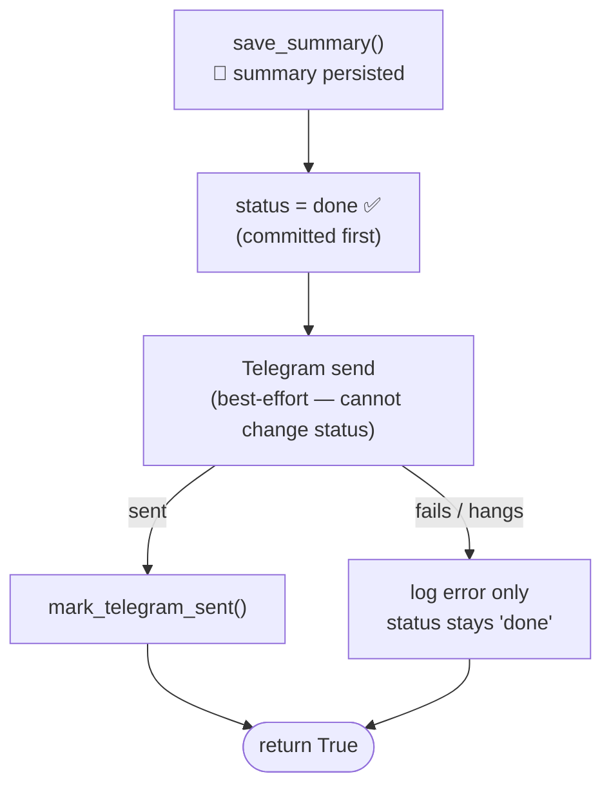
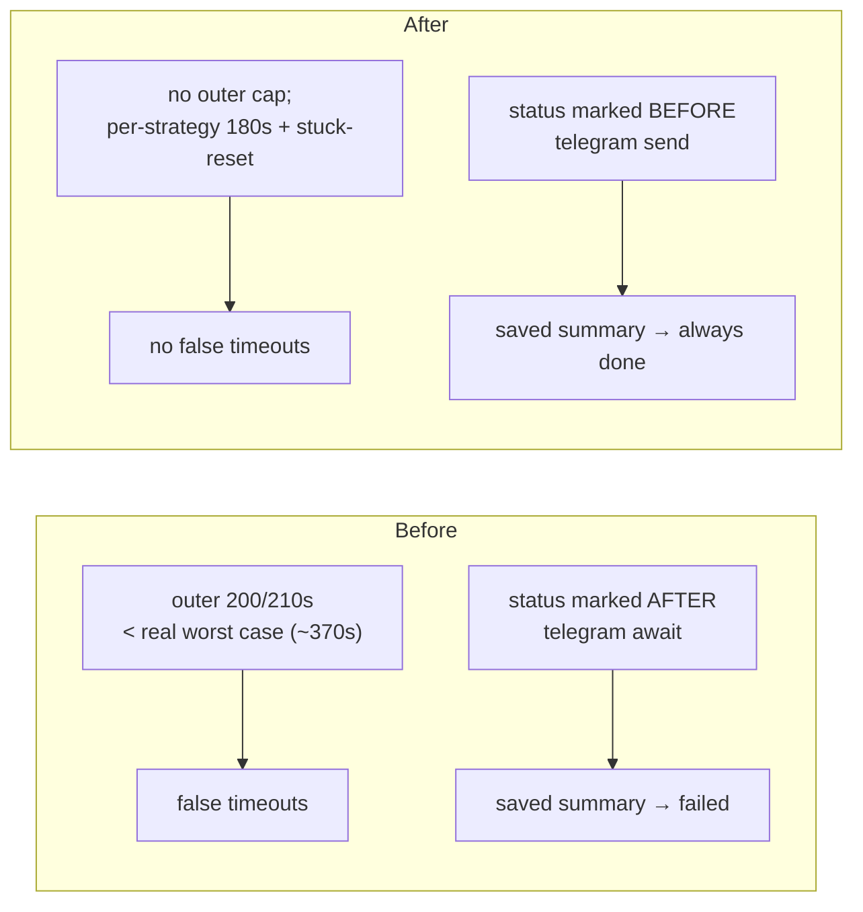
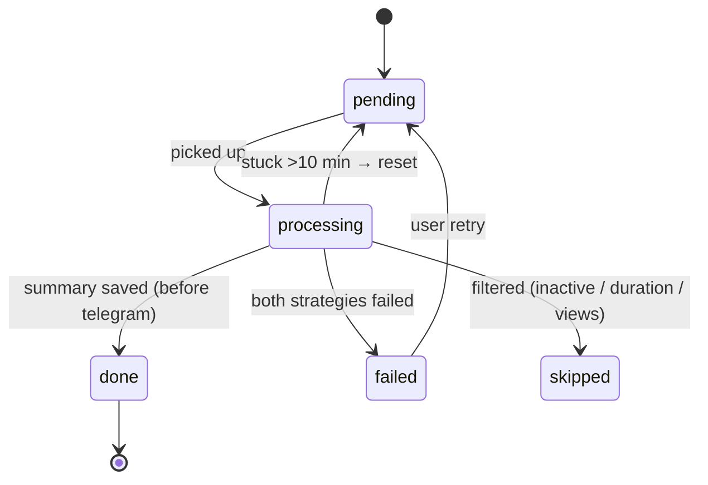

# YouTube Queue Processing — Timeouts & Status Flow

This document explains how a YouTube video moves through the summarization
pipeline, why the two timeout errors used to appear, and how the current code
prevents them.

- **`Processing timed out (200s)`** — from the manual *"Process one"* button.
- **`Scheduler timeout after 210s`** — from the automatic 5‑minute scheduler.

Both came from the **same** function (`process_queue_item`) being wrapped in an
**outer `asyncio.wait_for`** that was sized smaller than the work it guarded.

---

## External APIs & Services

The pipeline relies entirely on these external services — no in-house ML:

| Service / API | Used for | Client library |
|---|---|---|
| **Google Gemini** (model `gemini-2.5-flash`, via Vertex AI) | Summarizing videos — both native video understanding and transcript text | `google-genai` (`google.genai`) |
| **YouTube Data API v3** | Keyword search, video metadata (title, duration, views) | `google-api-python-client` (`googleapiclient`) |
| **YouTube PubSubHubbub / WebSub hub** (`pubsubhubbub.appspot.com`) | Real-time push notifications when a tracked channel uploads | `httpx` (POST subscribe) |
| **YouTube RSS Atom feeds** (`videos.xml`) | The feed topic WebSub pushes — parsed for new video IDs | stdlib XML parsing |
| **youtube-transcript-api** | Fetching captions/transcripts (Strategy 2 fallback) | `youtube-transcript-api` |
| **Telegram (MTProto userbot)** | Delivering finished summaries to channels/chats | `Telethon` |

---

## 1. The two entry points

A queue item can be processed from two places. Both ultimately call the same
`process_queue_item()` in [`youtube_monitor/worker.py`](../youtube_monitor/worker.py).

---

## 2. What `process_queue_item` actually does

Each summarization **strategy** has its own internal **180s** cap
(`_ITEM_TIMEOUT_SECS`). The function tries Strategy 1, falls back to Strategy 2,
saves the summary, then sends Telegram.

Key timing fact: **worst case ≈ 180s (Strategy 1) + 180s (Strategy 2) +
metadata + Telegram ≈ up to ~370s.**

---

## 3. The bug (BEFORE)

Both callers wrapped the whole function in a second, **outer** timeout:

| Caller | Outer budget |
|---|---|
| `_run_queue_item_bg` (manual) | **200s** |
| `process_pending_queue` (scheduler) | **210s** (`_ITEM_TIMEOUT_SECS + 30`) |

That outer budget was barely larger than **one** 180s strategy — but the work
inside could legitimately take far longer. Two failure modes resulted:

### 3a. Capacity mismatch
If Strategy 1 ran near its full 180s and Strategy 2 was needed, the outer
200/210s fired partway through — even though the work was progressing normally.

### 3b. The "I can see the summary but it says failed" race
The outer `wait_for` could cancel at an `await` point **after** the summary was
already saved but **before** the row was marked `done` — typically during the
Telegram send. The summary was in the DB (visible in the dashboard), yet the
outer handler overwrote the row to `failed`.

A bigger timeout number only makes this **rarer**, not impossible — the race
still lands whenever the deadline falls on the Telegram send. There was also a
latent bug: the manual path imported `_OUTER_ITEM_TIMEOUT_SECS`, a constant that
was never defined, which would have crashed *"Process one"* with an `ImportError`.

---

## 4. The fix (AFTER)

Two structural changes remove **both** root causes:

1. **Commit success before anything cancellable.** Inside `process_queue_item`,
   the item is marked `done` **immediately after `save_summary`**, and the
   Telegram send is now strictly best‑effort — a slow or failing send can no
   longer change the item's status.

2. **Remove the redundant outer `wait_for`** from both callers. The real
   guardrails were already in place:
   - each strategy is individually capped at **180s**, and
   - `reset_stuck_processing_items(stuck_minutes=10)` recovers any item that is
     genuinely wedged in `processing`.

### Why this is permanent, not a band-aid

| Concern | Old guard | New guard |
|---|---|---|
| Slow LLM call | outer 200/210s (too tight) | per‑strategy **180s** cap (unchanged) |
| Genuinely hung item | outer timeout | `reset_stuck_processing_items` (10 min) |
| Saved summary marked failed | ❌ happened | ✅ impossible — `done` set before send |
| Slow/failed Telegram | flipped to failed | logged only; status stays `done` |

---

## 5. Status state machine (current)

---

## 6. Relevant code

- [`youtube_monitor/worker.py`](../youtube_monitor/worker.py)
  - `_ITEM_TIMEOUT_SECS = 180` — per‑strategy cap
  - `process_queue_item()` — marks `done` before the best‑effort Telegram send
  - `process_pending_queue()` — calls `process_queue_item` directly (no outer timeout)
  - `reset_stuck_processing_items(stuck_minutes=10)` — hang recovery
- [`routers/youtube.py`](../routers/youtube.py)
  - `_run_queue_item_bg()` — manual path, no outer timeout
